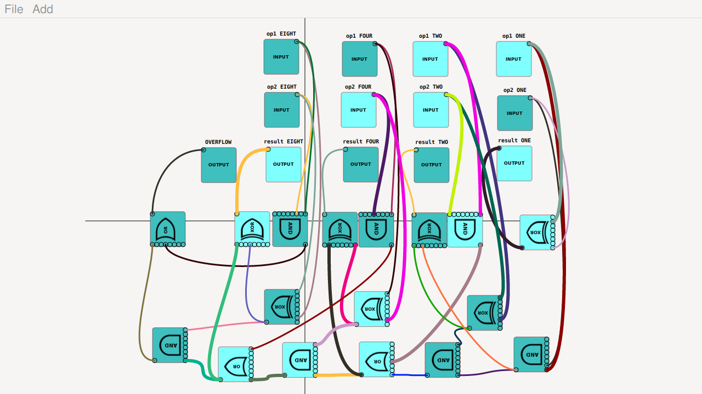

cLogicFun
=========

 3+6=9

This application allows you to create logic circuits.

Move the workspace or a node by dragging the mouse.

Left click the mouse on a node to edit some properties of a node or delete it.

Right click on IN nodes to change their state.

drag from a nodes output to another nodes input to create a wire.

delete a wire by clicking on its destination input. 

There are a number of examples to get you started...

Note a wire splitter node (SPLIT) has no delay, an inverted not gate (THRU) has latency

As a nodes single output can have multiple wires the SPLIT node is deprecated...

